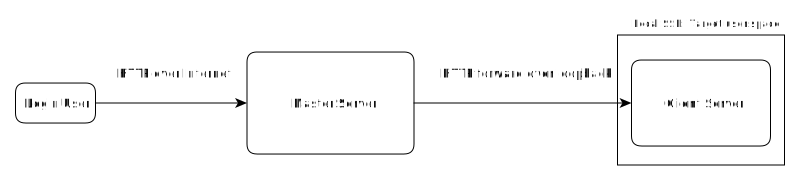
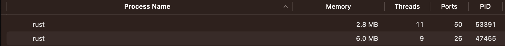

# Web ssh tool

This tool is a web server that support normal web browser for ssh connect to server. It work as a ssh reverse proxy. It request to deploy on server. The client side doesn't need to install any tools but visit the website and access the server ssh. It is convenient for the device not ready with ssh tools but has browsers like pad or guest pc.

At the same time, it also provide file system service. You can preview/download server's file or upload file to server.


The software would be built in only one binary file. No dynamic library, no resource file, no work directory. Portable and stable. (The built binary file contains your ssl cert and key. Do not share it to untrust devices. )

# Get the software

Project is open source. To build the app (after clone the project):

```console
cd <project>
npm i
```

Put your key and cert in rust/src/tls (Do not share the bin to untrust device).
Or generate manually:

```console
cd rust/src/tls
openssl req -nodes -new -x509  -keyout server.key -out server.crt
```

Build the bin:

```console
npm run build
```

The bin will appear in:

```console
rust/target/release/rust
```

# Run the software

Just run the bin, or create a system service for bin.

```console
nano /etc/systemd/system/web-ssh-tool.service
```

```console
[Unit]
Description=<description>
After=network.target

[Service]
User=root
Group=root
WorkingDirectory=<dir>
ExecStart=<bin>
ExecReload=/bin/kill -s HUP $MAINPID
RestartSec=5

[Install]
WantedBy=multi-user.target
```

```console
systemctl start web-ssh-tool.service
```

IMPORTANT: make sure the bin has the right permission that can be executed by the user that you will login later.

Get run help

```console
<bin> --help
```

The software does't need any permission like root permission (but network permission for http server). It can run under any user. Software will get the right permissions after you correctly login with your username and password on the website (login root and act like root, login guest and act like guest).

# Software Runtime Structure

When bin run, generally run in master mode. Master mode just provide http server for web and reverse http proxy for loopback.



When user login, master server will help user to create a ssh connection on the server locally and use the ssh connection to create a new process (the same bin but run in client mode) in the target user space. Because the new process created by the target user and running in the target user space, it has the same permission as the target user.

Now all the operation send to master will be forwarded to the client server. The client server will do the real job for user under the right permission. And also the master server doesn't need any permission.

Both master and client handle request and response in stream, so the total memory usage will be controlled as low as possible.



# Runtime

This software relay on system ssh service and pseudo tty. The server side should provide these features.

Linux and macOS usually come with pseudo tty.

Windows may not come with pseudo tty but you can checkout the [website](https://devblogs.microsoft.com/commandline/windows-command-line-introducing-the-windows-pseudo-console-conpty/).

# Available platform

By now, the support platform is limited by dependence packages that only support x86_64/x86/aarch64/arm/wasm32 (the rust-ring build script limitation).

Hint: try out cross-rs for cross compile the project.

# Available browser

The browser supports ES2015.

# Development

Request node and rust's build toolchain.

Backend is written in rust (tokio/hyper).<br/>
Frontend is written in react and built by vite.<br/>
