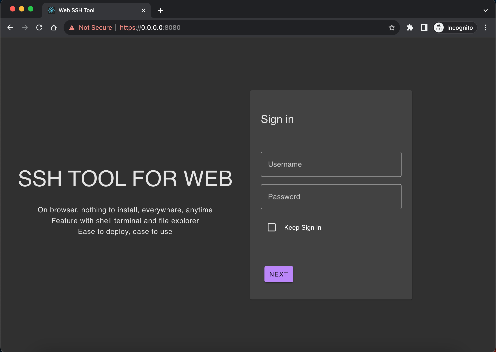
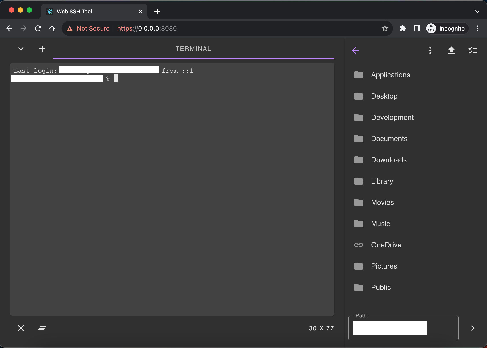

# Web ssh tool

This tool is a web server that support normal chrome for ssh connect to server. It request be deploy on server and provide a website for client. Client side has not need to install any tools but visit the website and access the server ssh. It is convenient for the device not ready with ssh tools but has browsers like ipad or guest pc.

At the same time, it also provide file system service. You can preview/download server's file or upload file to server.





# Get the software

Software is open source. To build the app (after clone the project):

```console
npm i
npm run build
```

# Run the software

Just run the bin, or create a system service for bin.

Get run help

```console
<bin> --help
```

The software does't need any permission like root permission. It can run by any system user. Software will get the right permissions after you correctly login with your username and password on the website (login root and act like root, login guest and act like guest).

# Develop this software

Request node and rust's build toolchain.

Backend is written in rust (tokio/hyper).

Frontend is written in react and built by vite.
